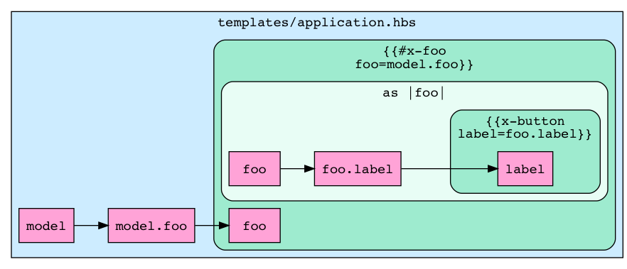

# ember-trace

[](https://badge.fury.io/js/ember-trace)

Generate [Graphviz] dataflow graphs for your Ember app.

## What & Why?

Given some templates:

```
app/templates/
├── application.hbs
└── components
    ├── x-bar.hbs
    └── x-foo.hbs
```

Running ember trace:

```sh
$ ember trace app/templates/application.hbs | dot -Tpng > docs/images/example.png
```

Will produce something like this:



These graphs can be useful for analysing how data flows through Ember apps.
Put another way, they’re a visual tool for answering questions like “where did
this value come from?” and “who owns it?”.

## Installation

```
ember install ember-trace
```

Then [download and install GraphViz](http://graphviz.org/download/).

## Usage

```
ember trace app/templates/my-route.hbs
```

This command emits the graph to stdout in [Graphviz DOT format]. You’ll
probably want to pipe it straight into the `dot` program to generate the graph.

```
ember trace app/templates/my-route.hbs | dot -Tpdf > graph.pdf
```

Some ember-cli addons emit deprecation warnings on stdout, so you’ll want to
strip those before handing it over to `dot`.

```
ember trace app/templates/my-route.hbs | sed 's/^DEPRECATION.*$//g' | dot -Tpdf > graph.pdf
```

## History

Created as an experiment in early 2018 by the Human Interface Team at [Heroku].

[Graphviz]: http://graphviz.org/
[Graphviz DOT format]: https://www.graphviz.org/doc/info/lang.html
[Heroku]: https://heroku.com/
